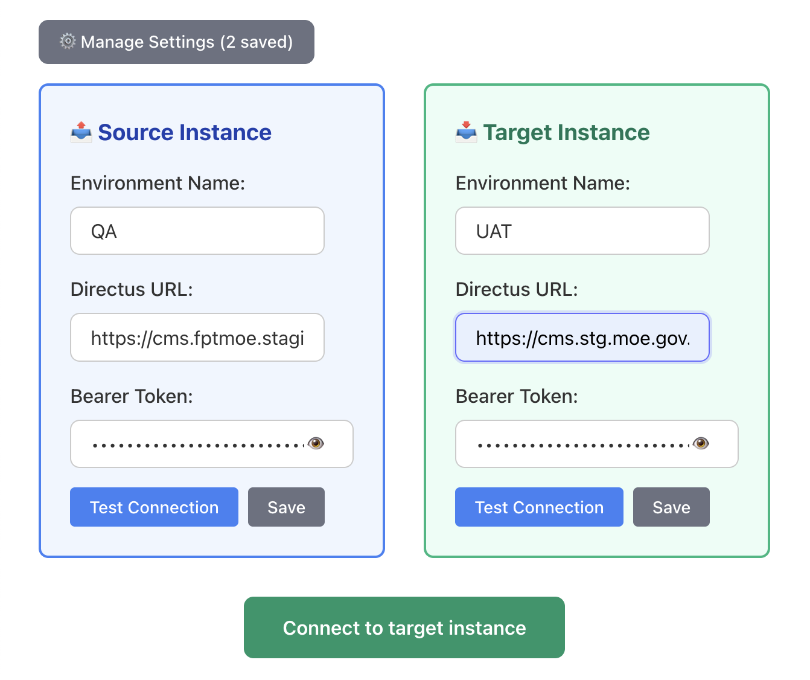

# Hướng Dẫn Data Migration

Tài liệu hướng dẫn import data từ collections:

- Selective Import: Chọn items cụ thể để import
- Field Selection: Chọn fields cụ thể để migrate

---

## Yêu Cầu

1. Có quyền truy cập Directus (admin token) cho cả source và target
2. Collection trên target phải tồn tại (status badge là "Existing", nếu là “New”, cần chạy Schema Migration trước)
3. Quyền: Read (source), Create/Update (target)



---

## Selective Import (Chọn items cụ thể để import)

1. Vào danh sách “Custom Collections”, chọn collection cần import
2. Bấm “📋 Select Items” để mở modal
3. Modal tự động load tất cả items từ source
4. Tick chọn những items muốn import
5. (Tùy chọn) Chọn fields muốn migrate - **Quan trọng nếu collection có relations** (xem phần [Field Selection](#field-selection-chọn-fields-để-migrate) bên dưới)
6. Bấm “Import Selected” để bắt đầu

**Kết quả:**

- Tool chỉ import các items đã chọn
- Hiển thị tiến trình dạng X/Y và thống kê: created / updated / failed

**Lưu ý:**

- ⚠️ Nếu collection có trạng thái "New" trên target, nút import bị vô hiệu hoá → hãy sync schema trước rồi quay lại import
- ⚠️ Với collections rất lớn, Selective Import giúp chia nhỏ dữ liệu theo đợt
- ⚠️ **Nếu collection có foreign keys** (relation fields), nên sử dụng Field Selection để tránh lỗi 403/400 (xem phần [Field Selection](#field-selection-chọn-fields-để-migrate))

---

## Field Selection (Chọn fields để migrate)

### Mục đích chính: Xử lý Collections có liên kết với nhau

**Field Selection** được thiết kế chủ yếu để giải quyết vấn đề khi migration các collection có **foreign keys** (liên kết) với các collection khác.

### Vấn đề thường gặp

Khi migration data chứa **foreign keys** (relation fields) đến các collections chưa được migrate:

- ❌ **Lỗi 403 FORBIDDEN**: Foreign key reference đến item không tồn tại trên target
- ❌ **Lỗi 400 BAD REQUEST**: Validation failed do reference ID không hợp lệ
- ❌ **Lỗi Constraint**: Database constraint violation

**Ví dụ:**

```
Collection: posts
- title: "Bài viết 1"
- category_id: 123  ← Reference đến collection "categories" (chưa được migrate)
- author_id: 456    ← Reference đến collection "authors" (chưa được migrate)
```

Nếu import `posts` trước khi `categories` và `authors` có data → **Lỗi 403/400**

### Giải pháp 2 bước (Two-Pass Migration)

#### **Bước 1: Import chỉ Regular Fields (Bỏ qua Relation Fields)**

1. Bấm "📋 Select Items" trên collection cần import
2. Trong modal, bật **Field Selection**
3. Chỉ chọn các **regular fields** (text, number, date, boolean, ...)
4. **Bỏ qua tất cả relation fields** (fields kết thúc bằng `_id` hoặc có type là relation):
   - `category_id`, `author_id`, `parent_id`
   - `client_id`, `site_id`, `product_id`
   - Bất kỳ field nào reference đến collection khác
5. Bấm "Import Selected" để migrate

**Kết quả:**

- ✅ Data được import thành công (không có foreign key errors)
- ✅ Items có ID gốc được giữ nguyên
- ⚠️ Các relation fields bị bỏ qua (có thể update sau)

#### **Bước 2: Update Relation Fields (Sau khi collections liên quan đã có data)**

Sau khi các collections được reference đã có data trên target:

1. Bấm "📋 Select Items" lại trên cùng collection
2. Chọn **cùng các items** đã import ở Bước 1
3. Trong Field Selection, chỉ chọn các **relation fields** cần update:
   - `category_id`, `author_id`, `parent_id`, ...
4. Bấm "Import Selected" để update

**Kết quả:**

- ✅ Tool sẽ kiểm tra item đã tồn tại (theo ID) → Thực hiện **UPDATE** (PATCH)
- ✅ Relation fields được cập nhật với ID đúng trên target
- ✅ Data hoàn chỉnh với đầy đủ relations

### Các loại Fields

**System Fields** (Luôn được bỏ qua tự động):

- `id`, `date_created`, `date_updated`
- `user_created`, `user_updated`

**Regular Fields** (Import ở Bước 1):

- `title`, `name`, `description`, `content`
- `price`, `quantity`, `status`
- `created_at`, `published_at`
- `is_active`, `enabled` (boolean)
- File fields (single file)

**Relation Fields** (Import ở Bước 2):

- Fields kết thúc bằng `_id`: `category_id`, `author_id`
- Fields reference đến collection khác
- Many-to-one, One-to-many relations

### Workflow ví dụ: Migration Blog System

**Collections có dependencies:**

- `categories` (không có relations)
- `authors` (không có relations)
- `posts` (có relations: `category_id`, `author_id`)
- `comments` (có relations: `post_id`, `author_id`)

**Thứ tự migration:**

1. **Import collections không có relations:**

   - Import `categories` (toàn bộ fields)
   - Import `authors` (toàn bộ fields)

2. **Import collections có relations - Bước 1 (Regular Fields only):**

   - Import `posts` → Chỉ chọn: `title`, `content`, `slug`, `published_at`
   - Bỏ qua: `category_id`, `author_id`
   - Import `comments` → Chỉ chọn: `content`, `created_at`
   - Bỏ qua: `post_id`, `author_id`

3. **Update relations - Bước 2 (Relation Fields only):**
   - Update `posts` → Chỉ chọn: `category_id`, `author_id`
   - Update `comments` → Chỉ chọn: `post_id`, `author_id`

**Kết quả:** Tất cả data được import đầy đủ với relations đúng! ✅

### Lưu ý quan trọng

- ⚠️ **Đảm bảo ID giữ nguyên**: Tool sử dụng ID gốc để match items khi update
- ⚠️ **Kiểm tra ID mapping**: Nếu collections liên quan có ID khác giữa source và target, cần mapping trước
- ⚠️ **System collections**: Relations đến `directus_users`, `directus_files` cần đảm bảo IDs match
- ✅ **Có thể import nhiều lần**: Field Selection cho phép import/update từng phần fields

## Import All (Tùy chọn)

Nếu muốn import toàn bộ collection:

1. Chọn collection (trạng thái “Existing” trên target)
2. Bấm “Import All” để import tất cả items
3. Theo dõi tiến trình và kết quả

Lưu ý: “Import All” không áp dụng Field Selection (sẽ gửi toàn bộ fields trừ system fields bị loại tự động)

---

## Troubleshooting

### 1) Cannot import to new collections → Schema Required

- **Nguyên nhân**: Collection chưa tồn tại trên target
- **Cách xử lý**: Chạy Schema Migration trước, đảm bảo collection có status "Existing" rồi quay lại import

### 2) Lỗi 403/400 khi import collections có relations

**Triệu chứng:**

```
Error 403 FORBIDDEN
Error 400 BAD REQUEST - Foreign key constraint failed
```

**Nguyên nhân:**

- Collection đang import có foreign keys đến collections chưa có data trên target
- Ví dụ: Import `posts` với `category_id: 123` nhưng `categories` collection chưa có item ID=123

**Giải pháp:** Sử dụng **Field Selection với Two-Pass Migration**

1. **Bước 1**: Import chỉ regular fields (bỏ qua relation fields)
2. Migrate các collections được reference trước
3. **Bước 2**: Update lại relation fields sau khi collections liên quan đã có data

Xem chi tiết ở phần [Field Selection](#field-selection-chọn-fields-để-migrate) phía trên.

### 3) Lỗi 403 FORBIDDEN (không liên quan relations)

- **Nguyên nhân**: Thiếu quyền (target) hoặc bị chặn bởi flow/hook
- **Cách xử lý**:
  - Kiểm tra admin token có đủ quyền Create/Update trên target
  - Kiểm tra flows/hooks có block request không
  - Xem error logs để biết chi tiết (bấm "🚨 Error Logs")

### 4) Item không được update (chỉ tạo mới)

- **Nguyên nhân**: ID format khác (string vs number) hoặc ID không khớp
- **Cách xử lý**: Đảm bảo ID giữ nguyên định dạng; tool kiểm tra tồn tại theo `id` gốc

### 5) Relation fields không được update sau khi import

- **Nguyên nhân**: Quên thực hiện Bước 2 hoặc chọn sai items
- **Cách xử lý**:
  - Đảm bảo chọn đúng các items đã import ở Bước 1
  - Chỉ chọn relation fields trong Field Selection
  - Tool sẽ tự động detect item tồn tại và thực hiện UPDATE

---

## Tham Chiếu API Liên Quan

- `previewCollectionItems(sourceUrl, sourceToken, collectionName, { limit: -1 })`

  - Tải danh sách items (hỗ trợ meta total_count)

- `importSelectedItems(sourceUrl, sourceToken, targetUrl, targetToken, collectionName, selectedIds, { selectedFields, onProgress })`

  - Import các items đã chọn; chỉ migrate các fields được chỉ định

- `importFromDirectus(sourceUrl, sourceToken, targetUrl, targetToken, collectionName, { limit, onProgress })`
  - Import toàn bộ collection (không áp dụng Field Selection)

---

Phiên bản: 1.0 (tối giản cho Data Migration)
